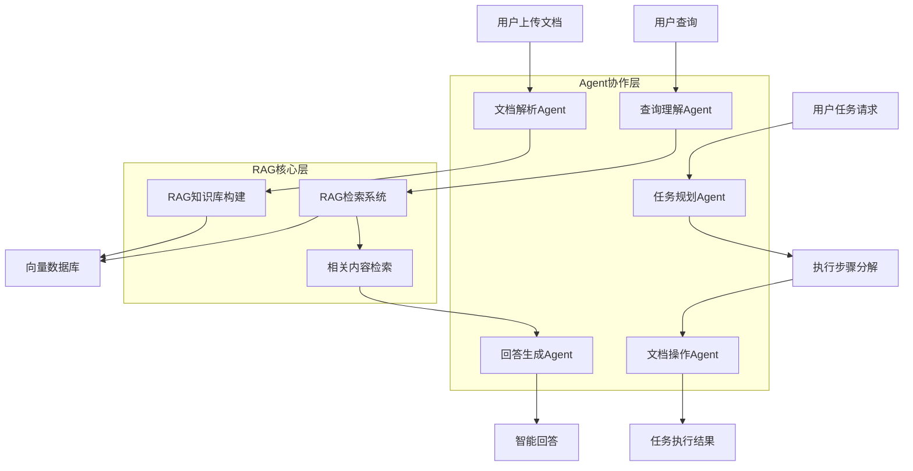
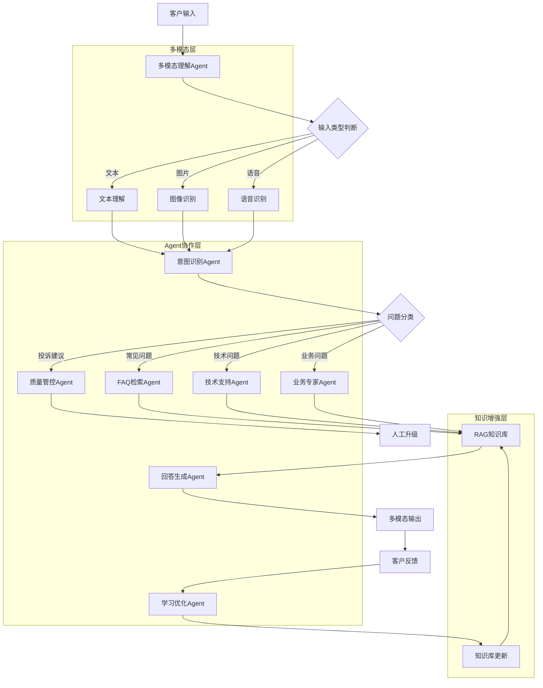
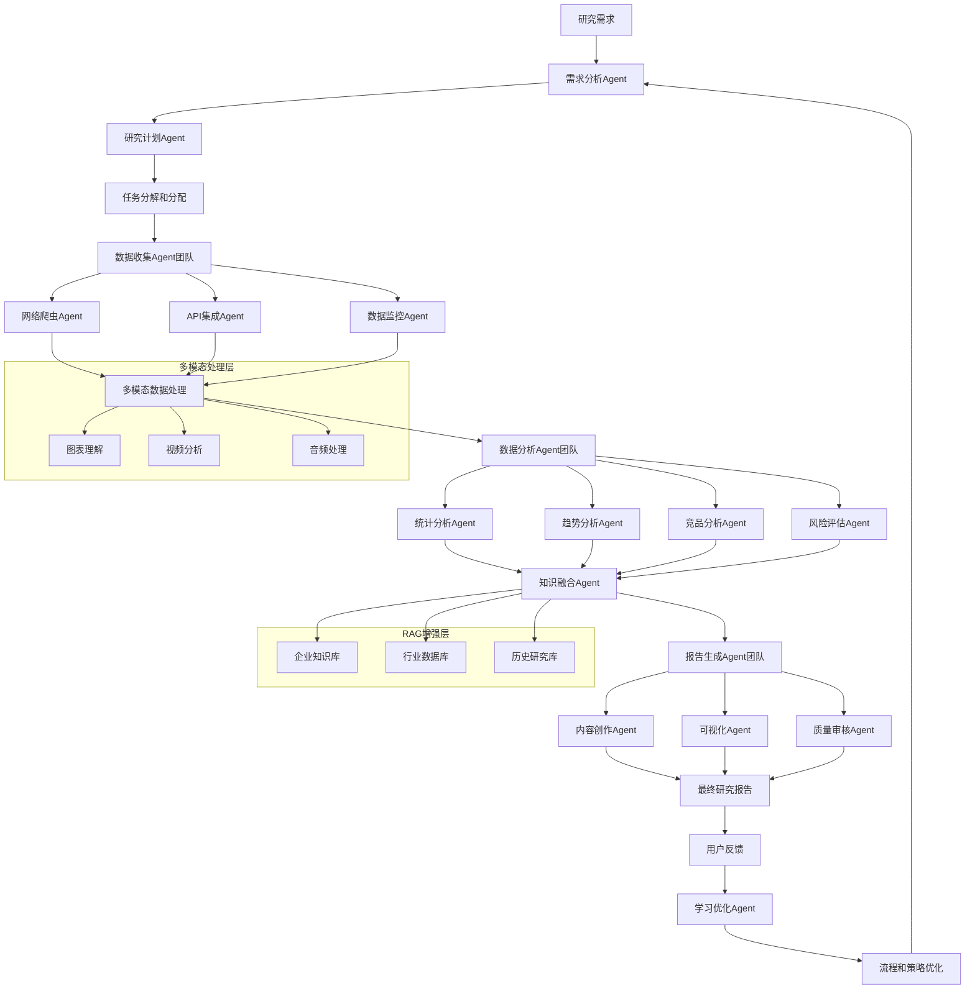

# 技术实践项目规划（RAG + 多模态 + Agent 整合应用）

## 🎯 实践目标

将前面学习的**RAG（检索增强生成）+ 多模态大模型 + Agent系统**三大核心技术整合应用，通过实际项目加深理解并积累实战经验。

---

## 📋 项目选择矩阵

| 项目 | 复杂度 | 时间投入 | 技术整合度 | 商业价值 | 适合人群 |
|------|--------|----------|------------|----------|----------|
| **项目一：智能文档助手** | ⭐⭐⭐ | 1-2周 | RAG为主+Agent | 中等 | 初学者、快速验证 |
| **项目二：多模态智能客服** | ⭐⭐⭐⭐ | 2-4周 | 三技术均衡整合 | 高 | 有一定基础、求职展示 |
| **项目三：企业级研究助手** | ⭐⭐⭐⭐⭐ | 4-8周 | 深度技术融合 | 极高 | 进阶学习、商业应用 |

---

## 🚀 项目一：智能文档助手 QuickDoc AI

### 📖 项目概述
构建一个能够智能理解、分析和操作文档的AI助手，支持多种格式文档的问答、摘要、分析等功能。

### 🎯 核心功能
1. **文档上传与解析**：支持PDF、Word、Excel、PPT等格式
2. **智能问答**：基于文档内容的精准问答
3. **自动摘要**：生成文档摘要和关键信息提取
4. **内容分析**：情感分析、主题分类、关键词提取
5. **任务执行**：根据文档内容执行特定任务（如生成会议纪要）

### 🏗️ 技术架构


### 🛠️ 技术栈建议（2025年AI主流技术）
```
🤖 大模型选择（最佳性能）：
├─ GPT-4 Turbo：文本理解和生成（OpenAI）
├─ Claude-3 Opus：复杂推理和分析（Anthropic）
├─ GPT-4V：多模态理解（OpenAI）
└─ Embedding模型：text-embedding-3-large

🔧 Agent开发框架：
├─ LangChain：Python生态最成熟的Agent框架
├─ AutoGen：微软开源多Agent协作框架
├─ CrewAI：专业的Agent团队协作平台
└─ LangGraph：状态机驱动的Agent工作流

🐍 后端架构（Python AI生态）：
├─ FastAPI：现代异步API框架，AI项目首选
├─ Pydantic：数据验证和序列化
├─ asyncio：异步编程，高并发处理
└─ uvicorn：ASGI服务器

📄 文档处理：
├─ PyMuPDF：PDF解析和处理
├─ python-docx：Word文档处理
├─ pandas + openpyxl：Excel数据处理
└─ UnstructuredIO：通用文档解析库

🎨 前端展示：
├─ Next.js 14：React全栈框架，最新App Router
├─ Tailwind CSS：原子化CSS框架
├─ Shadcn/ui：现代化组件库
└─ Framer Motion：动画效果库

💾 数据存储：
├─ Qdrant：向量数据库，性能最佳
├─ PostgreSQL + pgvector：关系数据+向量扩展
├─ Redis：缓存和会话管理
└─ Supabase：开源Firebase替代品
```

### 📅 实施计划（2周）
```
第1周：基础功能开发
├─ Day 1-2：项目搭建、文档解析功能
├─ Day 3-4：RAG系统集成、向量数据库
├─ Day 5-6：基础问答功能实现
└─ Day 7：系统测试和优化

第2周：Agent增强和完善
├─ Day 8-9：Agent系统集成、任务分解
├─ Day 10-11：多种任务执行功能
├─ Day 12-13：前端界面开发
└─ Day 14：整体测试和部署
```

### 🎯 预期成果
- 掌握RAG在文档问答中的实际应用
- 理解Agent任务分解和执行机制
- 获得一个可展示的完整项目
- 具备基础的企业级AI应用开发能力

---

## 🤖 项目二：多模态智能客服系统 SmartSupport

### 📖 项目概述
构建一个支持文字、图片、语音多模态交互的智能客服系统，能够处理复杂的客户服务场景并提供专业的解决方案。

### 🎯 核心功能
1. **多模态交互**：文字对话、图片识别、语音交互
2. **智能路由**：自动识别问题类型并路由给专业Agent
3. **知识库问答**：基于企业知识库的精准回答
4. **工单处理**：自动生成、分类、跟踪工单
5. **情感分析**：识别客户情绪并调整服务策略
6. **多Agent协作**：前台接待、技术支持、业务专家等Agent协作

### 🏗️ 技术架构


### 🛠️ 技术栈建议（2025年企业级AI技术）
```
🤖 大模型能力（最强组合）：
├─ GPT-4 Turbo：主对话引擎（OpenAI）
├─ Claude-3 Opus：复杂推理和分析（Anthropic）
├─ GPT-4V：图像理解和分析（OpenAI）
├─ Whisper：语音转文本（OpenAI）
└─ ElevenLabs：文本转语音，最自然

🔧 Agent协作框架：
├─ AutoGen：微软多Agent协作框架
├─ CrewAI：专业Agent团队管理
├─ LangGraph：复杂工作流编排
└─ Chainlit：实时对话界面框架

🐍 后端架构（异步高性能）：
├─ FastAPI：异步API框架，AI项目标配
├─ WebSocket：实时通信支持
├─ Celery + Redis：异步任务队列
└─ asyncio：协程并发处理

📊 数据处理和存储：
├─ Qdrant：高性能向量数据库
├─ PostgreSQL + pgvector：混合数据存储
├─ Elasticsearch：全文搜索引擎
├─ InfluxDB：时序数据监控
└─ MinIO：对象存储服务

🎨 现代化前端：
├─ Next.js 14：全栈React框架
├─ Tailwind CSS + Shadcn/ui：组件系统
├─ Zustand：轻量状态管理
├─ SWR：数据获取和缓存
└─ Framer Motion：流畅动画效果

📈 监控与运维：
├─ Prometheus + Grafana：指标监控
├─ Jaeger：分布式链路追踪
├─ ELK Stack：日志聚合分析
└─ Docker + K8s：容器化部署
```

### 📅 实施计划（4周）
```
第1周：基础架构搭建
├─ 多模态输入处理模块
├─ RAG知识库构建
├─ 基础Agent框架搭建
└─ 数据库设计和API设计

第2周：核心Agent开发
├─ 意图识别和问题分类Agent
├─ FAQ检索Agent开发
├─ 技术支持Agent开发
└─ Agent间通信机制

第3周：高级功能实现
├─ 多模态输出生成
├─ 工单系统集成
├─ 情感分析和策略调整
└─ 学习优化机制

第4周：系统集成和优化
├─ 前端客服界面开发
├─ 管理后台开发
├─ 性能优化和测试
└─ 部署和监控配置
```

### 🎯 预期成果
- 掌握多模态AI在实际业务中的应用
- 深入理解多Agent协作机制
- 获得企业级客服系统开发经验
- 具备复杂AI系统架构设计能力

---

## 🔬 项目三：企业级智能研究助手 ResearchPro AI

### 📖 项目概述
构建一个企业级的智能研究助手，能够自动收集信息、分析数据、生成报告，支持市场研究、竞品分析、投资研究等多种研究场景。

### 🎯 核心功能
1. **自动信息收集**：网络爬虫、API集成、数据源监控
2. **多模态数据处理**：文本、图表、视频等多种数据分析
3. **智能研究流程**：研究计划制定、执行、监控、调整
4. **协作式分析**：多个专业Agent协同完成复杂研究任务
5. **动态报告生成**：自动生成专业研究报告和可视化
6. **持续学习优化**：基于反馈持续改进研究方法和质量

### 🏗️ 技术架构


### 🛠️ 技术栈建议（2025年企业级AI平台）
```
🧠 AI模型层（最强大脑）：
├─ GPT-4 Turbo：通用推理和生成（OpenAI）
├─ Claude-3 Opus：深度分析和长文本（Anthropic）
├─ Gemini Ultra：多模态理解（Google）
├─ GPT-4V：图像和图表理解（OpenAI）
├─ Whisper Large：音频转文本（OpenAI）
└─ Code Llama：代码生成和分析（Meta）

🤖 Agent编排平台：
├─ Microsoft AutoGen：企业级多Agent框架
├─ LangGraph：状态机工作流编排
├─ CrewAI：专业Agent团队管理
├─ Semantic Kernel：微软AI编排引擎
└─ LlamaIndex：数据连接和索引框架

🏗️ 微服务架构（Cloud Native）：
├─ FastAPI：高性能异步API网关
├─ Kong/Envoy：服务网格和负载均衡
├─ Consul：服务发现和配置中心
├─ NATS：轻量级消息系统
└─ Apache Kafka：大规模事件流处理

📊 大数据和实时处理：
├─ Apache Spark：大数据批处理
├─ Apache Flink：实时流处理
├─ Ray：分布式AI计算框架
├─ Dask：Python并行计算
└─ Apache Airflow：工作流调度

💾 现代数据栈：
├─ Qdrant/Weaviate：企业级向量数据库
├─ PostgreSQL + pgvector：混合数据存储
├─ ClickHouse：高性能分析数据库
├─ Elasticsearch：搜索和分析引擎
├─ Apache Iceberg：数据湖存储格式
└─ Delta Lake：数据湖事务支持

🌐 前端和可视化：
├─ Next.js 14：全栈应用框架
├─ React + TypeScript：类型安全开发
├─ D3.js + Observable Plot：数据可视化
├─ Streamlit：AI应用快速原型
└─ Gradio：机器学习界面框架

☁️ 云原生运维（DevOps）：
├─ Kubernetes：容器编排平台
├─ Helm：K8s应用包管理
├─ Istio：服务网格治理
├─ ArgoCD：GitOps持续部署
├─ Prometheus + Grafana：监控告警
├─ Jaeger：分布式链路追踪
├─ ELK/EFK Stack：日志聚合分析
└─ Terraform：基础设施即代码
```

### 📅 实施计划（8周）
```
第1-2周：系统架构和基础服务
├─ 微服务架构搭建
├─ 数据存储层设计
├─ API网关和配置中心
├─ 基础Agent框架
└─ 数据收集基础服务

第3-4周：核心Agent开发
├─ 需求分析和规划Agent
├─ 数据收集Agent团队
├─ 多模态数据处理能力
├─ RAG知识库集成
└─ Agent间通信机制

第5-6周：分析和生成能力
├─ 数据分析Agent团队
├─ 统计和趋势分析
├─ 知识融合和推理
├─ 报告生成Agent团队
└─ 可视化和图表生成

第7-8周：高级功能和优化
├─ 学习优化机制
├─ 质量控制系统
├─ 性能监控和告警
├─ 前端管理界面
├─ 系统测试和调优
└─ 部署和运维配置
```

### 🎯 预期成果
- 掌握企业级AI系统的完整开发流程
- 深入理解大规模Agent协作系统设计
- 获得多模态数据处理和分析经验
- 具备AI产品从0到1的完整能力
- 积累可商业化的项目经验

---

## 🎯 选择建议

### **如果您是**：
- **快速验证学习成果** → 选择项目一：智能文档助手
- **求职展示或技能提升** → 选择项目二：多模态智能客服
- **深度学习或商业应用** → 选择项目三：企业级研究助手

### **技术栈匹配度**：
- **追求最新技术** → Python生态+最强大模型组合
- **企业级应用** → 微服务架构+云原生技术栈
- **快速原型验证** → FastAPI+Streamlit组合

### **时间投入考虑**：
- **1-2周** → 项目一
- **1个月** → 项目二  
- **2个月** → 项目三

---

## 💡 技术栈选择说明

### 🔍 核心概念澄清：框架 vs 大模型

**大模型**（AI能力提供者）：
- GPT-4、Claude-3、Gemini：提供智能理解和生成能力
- 就像"大脑"，负责思考和推理

**开发框架**（工具和胶水）：
- LangChain、AutoGen、CrewAI：连接、编排、管理大模型
- 就像"神经系统"，协调各个大脑协作

**类比理解**：
```
🧠 大模型 = 专家团队（医生、律师、工程师）
🔧 框架 = 管理系统（任务分配、沟通协调、结果整合）
🏗️ 应用 = 完整的咨询公司（对外提供服务）
```

### 🎯 2025年技术栈选择理由

#### **为什么选择Python生态**：
✅ **AI社区首选**：90%的AI研究和开源项目使用Python  
✅ **库生态最丰富**：LangChain、Transformers、PyTorch等  
✅ **迭代速度最快**：新技术首先在Python实现  
✅ **企业采用率高**：OpenAI、Anthropic官方SDK都是Python优先  

#### **为什么选择这些大模型**：
- **GPT-4 Turbo**：目前综合能力最强，API稳定
- **Claude-3 Opus**：长文本理解能力最佳，推理质量高  
- **GPT-4V**：多模态理解领域的标杆
- **Whisper**：语音识别准确率最高，开源免费

#### **为什么选择这些框架**：
- **AutoGen**：微软出品，多Agent协作最成熟
- **LangChain**：社区最活跃，文档最完善
- **FastAPI**：性能最高的Python Web框架
- **Next.js 14**：React生态最新技术，开发效率最高

### 🚀 技术栈优势

1. **最强AI能力**：直接使用顶级大模型，而非降级版本
2. **最新技术栈**：2025年主流技术，求职和商业价值最高
3. **最佳生态**：Python+JavaScript，开源社区支持最好
4. **最快迭代**：框架更新快，能快速跟上AI发展步伐

---

**当前学习路线**：大模型应用全链路学习路线（2025版·知识为主·实战为辅）
**当前阶段**：技术实践项目选择 🔄

您倾向于选择哪个项目？我会为您提供详细的实施指导和技术支持！ 