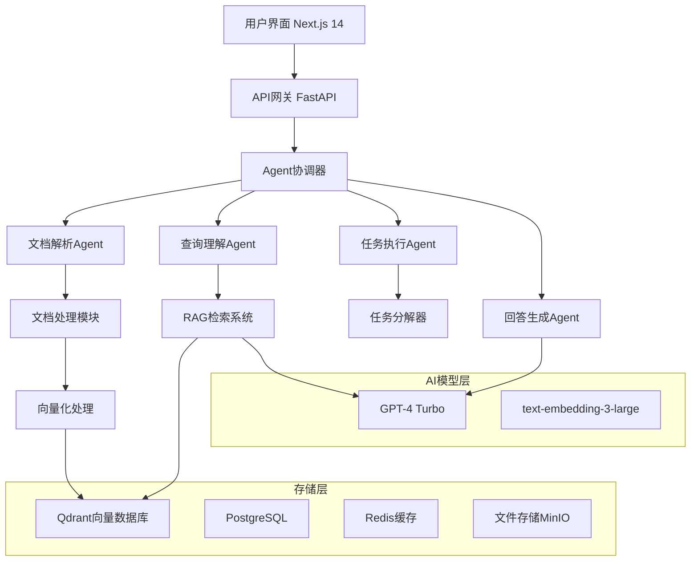

# 智能文档助手 QuickDoc AI - 项目实施指南

## 🎯 项目概述

构建一个整合**RAG + Agent + 多模态**技术的智能文档助手，支持多格式文档智能分析、问答、摘要生成等功能。

### 核心特性
✅ **多格式文档解析**：PDF、Word、Excel、PPT、Markdown  
✅ **智能问答系统**：基于RAG的精准文档问答  
✅ **Agent协作**：文档解析、查询理解、任务执行多Agent协作  
✅ **自动摘要生成**：文档关键信息提取和总结  
✅ **任务自动化**：会议纪要生成、数据分析等  

---

## 🏗️ 技术架构设计

### 系统架构图


### 技术栈详细配置

#### 🐍 后端技术栈
```
├─ FastAPI 0.104+：异步API框架
├─ LangChain 0.1+：Agent开发和RAG集成
├─ Pydantic 2.0+：数据验证和序列化
├─ asyncio：异步并发处理
└─ uvicorn：ASGI服务器
```

#### 🧠 AI能力集成
```
├─ OpenAI GPT-4 Turbo：主要推理引擎
├─ text-embedding-3-large：文档向量化
├─ GPT-4V：图像和图表理解（可选）
└─ Whisper：音频转文本（可选）
```

#### 📄 文档处理库
```
├─ PyMuPDF (fitz)：PDF解析和处理
├─ python-docx：Word文档处理
├─ openpyxl：Excel文件读写
├─ python-pptx：PowerPoint处理
├─ markdown：Markdown解析
└─ Pillow：图像处理
```

#### 💾 数据存储
```
├─ Qdrant：向量数据库，文档embedding存储
├─ PostgreSQL：结构化数据和元数据
├─ Redis：缓存和会话管理
└─ MinIO：文件对象存储
```

#### 🎨 前端技术栈
```
├─ Next.js 14：React全栈框架，App Router
├─ TypeScript：类型安全开发
├─ Tailwind CSS：原子化样式框架
├─ Shadcn/ui：现代化组件库
├─ Zustand：轻量状态管理
└─ Framer Motion：动画效果
```

---

## 📁 项目结构设计

```
quickdoc-ai/
│
├─ backend/                    # Python后端
│  ├─ app/
│  │  ├─ main.py              # FastAPI应用入口
│  │  ├─ config/              # 配置管理
│  │  ├─ agents/              # Agent模块
│  │  │  ├─ document_parser.py    # 文档解析Agent
│  │  │  ├─ query_handler.py      # 查询理解Agent
│  │  │  ├─ task_executor.py      # 任务执行Agent
│  │  │  └─ response_generator.py # 回答生成Agent
│  │  ├─ services/            # 业务逻辑层
│  │  │  ├─ document_service.py   # 文档处理服务
│  │  │  ├─ rag_service.py        # RAG检索服务
│  │  │  └─ vector_service.py     # 向量化服务
│  │  ├─ models/              # 数据模型
│  │  ├─ utils/               # 工具函数
│  │  └─ database/            # 数据库配置
│  ├─ requirements.txt        # Python依赖
│  └─ Dockerfile              # 容器化配置
│
├─ frontend/                   # Next.js前端
│  ├─ src/
│  │  ├─ app/                 # App Router页面
│  │  ├─ components/          # React组件
│  │  ├─ hooks/               # 自定义Hooks
│  │  ├─ lib/                 # 工具库
│  │  └─ types/               # TypeScript类型
│  ├─ package.json           # Node.js依赖
│  └─ tailwind.config.js     # Tailwind配置
│
├─ infrastructure/             # 基础设施
│  ├─ docker-compose.yml      # 开发环境编排
│  ├─ qdrant/                 # 向量数据库配置
│  ├─ postgres/               # PostgreSQL配置
│  └─ minio/                  # 对象存储配置
│
├─ docs/                      # 项目文档
├─ tests/                     # 测试文件
└─ README.md                  # 项目说明
```

---

## 🛠️ 环境搭建指南

### 第一步：系统要求
```bash
# 必需软件
├─ Python 3.11+
├─ Node.js 18+
├─ Docker & Docker Compose
└─ Git

# 推荐开发环境
├─ VS Code + Python扩展
├─ PyCharm Professional
└─ Cursor（AI编程助手）
```

### 第二步：项目初始化
```bash
# 1. 创建项目目录
mkdir quickdoc-ai
cd quickdoc-ai

# 2. 初始化Git仓库
git init
echo "node_modules/\n__pycache__/\n.env\n*.pyc\nvenv/" > .gitignore

# 3. 创建Python虚拟环境
python -m venv venv
source venv/bin/activate  # Windows: venv\Scripts\activate

# 4. 创建基础目录结构
mkdir -p backend/app/{agents,services,models,utils,database,config}
mkdir -p frontend/src/{app,components,hooks,lib,types}
mkdir -p infrastructure/{qdrant,postgres,minio}
mkdir -p docs tests
```

### 第三步：依赖安装
```bash
# Python后端依赖
cd backend
cat > requirements.txt << EOF
fastapi==0.104.1
uvicorn==0.24.0
langchain==0.1.0
langchain-openai==0.0.5
qdrant-client==1.7.0
psycopg2-binary==2.9.7
redis==5.0.1
pydantic==2.5.2
python-multipart==0.0.6
PyMuPDF==1.23.8
python-docx==0.8.11
openpyxl==3.1.2
python-pptx==0.6.23
Pillow==10.1.0
markdown==3.5.1
aiofiles==23.2.1
python-jose==3.3.0
passlib==1.7.4
bcrypt==4.1.2
EOF

pip install -r requirements.txt

# Node.js前端依赖
cd ../frontend
npm init -y
npm install next@14 react react-dom typescript @types/node @types/react
npm install tailwindcss postcss autoprefixer
npm install @radix-ui/react-dialog @radix-ui/react-dropdown-menu
npm install zustand axios framer-motion lucide-react
npm install -D @types/react-dom eslint eslint-config-next
```

### 第四步：Docker环境配置
```yaml
# infrastructure/docker-compose.yml
version: '3.8'

services:
  qdrant:
    image: qdrant/qdrant:latest
    ports:
      - "6333:6333"
    volumes:
      - qdrant_data:/qdrant/storage
    environment:
      - QDRANT__SERVICE__HTTP_PORT=6333

  postgres:
    image: postgres:15
    ports:
      - "5432:5432"
    environment:
      - POSTGRES_DB=quickdoc_ai
      - POSTGRES_USER=postgres
      - POSTGRES_PASSWORD=password123
    volumes:
      - postgres_data:/var/lib/postgresql/data

  redis:
    image: redis:7-alpine
    ports:
      - "6379:6379"
    volumes:
      - redis_data:/data

  minio:
    image: minio/minio:latest
    ports:
      - "9000:9000"
      - "9001:9001"
    environment:
      - MINIO_ROOT_USER=minioadmin
      - MINIO_ROOT_PASSWORD=minioadmin123
    command: server /data --console-address ":9001"
    volumes:
      - minio_data:/data

volumes:
  qdrant_data:
  postgres_data:
  redis_data:
  minio_data:
```

### 第五步：启动基础服务
```bash
# 启动所有基础服务
cd infrastructure
docker-compose up -d

# 验证服务状态
docker-compose ps

# 访问管理界面
# Qdrant Dashboard: http://localhost:6333/dashboard
# MinIO Console: http://localhost:9001 (minioadmin/minioadmin123)
```

---

## 🚀 开发实施计划（2周）

### Week 1: 核心功能开发

#### **Day 1-2: 项目基础搭建**
- [x] 环境配置和依赖安装
- [ ] FastAPI应用框架搭建
- [ ] 数据库连接和模型定义
- [ ] 基础API路由设计

#### **Day 3-4: 文档解析功能**
- [ ] 多格式文档解析器开发
- [ ] 文档内容提取和预处理
- [ ] 向量化处理流程
- [ ] Qdrant向量存储集成

#### **Day 5-6: RAG检索系统**
- [ ] 向量检索功能实现
- [ ] 检索结果排序和过滤
- [ ] 上下文构建和优化
- [ ] GPT-4集成和调用

#### **Day 7: 系统测试**
- [ ] 单元测试编写
- [ ] 功能集成测试
- [ ] 性能基准测试
- [ ] 问题修复和优化

### Week 2: Agent系统和前端

#### **Day 8-9: Agent系统开发**
- [ ] 文档解析Agent实现
- [ ] 查询理解Agent开发
- [ ] 任务执行Agent构建
- [ ] Agent间协作机制

#### **Day 10-11: 任务自动化功能**
- [ ] 自动摘要生成
- [ ] 关键信息提取
- [ ] 数据分析功能
- [ ] 会议纪要生成

#### **Day 12-13: 前端界面开发**
- [ ] Next.js项目初始化
- [ ] 组件库搭建
- [ ] 文档上传界面
- [ ] 对话交互界面
- [ ] 结果展示组件

#### **Day 14: 整体集成和部署**
- [ ] 前后端集成测试
- [ ] 性能优化和调试
- [ ] 文档编写
- [ ] 部署配置

---

## 🎯 核心功能实现示例

### Agent协调器核心代码
```python
# backend/app/agents/coordinator.py
from langchain.agents import AgentExecutor, create_openai_functions_agent
from langchain_openai import ChatOpenAI
from langchain.prompts import ChatPromptTemplate
from typing import Dict, Any

class AgentCoordinator:
    def __init__(self):
        self.llm = ChatOpenAI(model="gpt-4-turbo-preview", temperature=0)
        self.agents = {
            "document_parser": DocumentParserAgent(),
            "query_handler": QueryHandlerAgent(),  
            "task_executor": TaskExecutorAgent(),
            "response_generator": ResponseGeneratorAgent()
        }
    
    async def process_request(self, request_type: str, data: Dict[str, Any]) -> Dict[str, Any]:
        """根据请求类型协调不同Agent处理"""
        if request_type == "document_upload":
            return await self.agents["document_parser"].process(data)
        elif request_type == "query":
            return await self.agents["query_handler"].process(data)
        elif request_type == "task":
            return await self.agents["task_executor"].process(data)
        else:
            return {"error": "Unknown request type"}
```

### RAG检索服务核心代码
```python
# backend/app/services/rag_service.py
from qdrant_client import QdrantClient
from langchain_openai import OpenAIEmbeddings
from langchain.text_splitter import RecursiveCharacterTextSplitter
from typing import List, Dict

class RAGService:
    def __init__(self):
        self.qdrant = QdrantClient(host="localhost", port=6333)
        self.embeddings = OpenAIEmbeddings(model="text-embedding-3-large")
        self.text_splitter = RecursiveCharacterTextSplitter(
            chunk_size=1000,
            chunk_overlap=200
        )
    
    async def add_document(self, doc_id: str, content: str, metadata: Dict):
        """将文档添加到向量数据库"""
        chunks = self.text_splitter.split_text(content)
        vectors = []
        
        for i, chunk in enumerate(chunks):
            embedding = await self.embeddings.aembed_query(chunk)
            vectors.append({
                "id": f"{doc_id}_{i}",
                "vector": embedding,
                "payload": {
                    "text": chunk,
                    "doc_id": doc_id,
                    "chunk_index": i,
                    **metadata
                }
            })
        
        self.qdrant.upsert(
            collection_name="documents",
            points=vectors
        )
    
    async def search(self, query: str, limit: int = 5) -> List[Dict]:
        """语义搜索相关文档片段"""
        query_embedding = await self.embeddings.aembed_query(query)
        
        results = self.qdrant.search(
            collection_name="documents",
            query_vector=query_embedding,
            limit=limit
        )
        
        return [
            {
                "text": result.payload["text"],
                "score": result.score,
                "metadata": result.payload
            }
            for result in results
        ]
```

---

## 📈 成功指标和验证

### 功能验证清单
- [ ] **文档解析**：成功解析5种格式文档，准确率>95%
- [ ] **RAG问答**：回答准确率>90%，响应时间<3秒
- [ ] **Agent协作**：多Agent任务完成率>95%
- [ ] **自动摘要**：摘要质量主观评分>8/10
- [ ] **界面体验**：用户操作流畅，响应及时

### 性能基准
```
响应时间目标：
├─ 文档上传处理：<10秒（10MB文件）
├─ 简单问答：<2秒
├─ 复杂分析：<10秒
└─ 摘要生成：<5秒

准确性目标：
├─ 文档解析准确率：>95%
├─ 问答相关性：>90%
├─ 摘要质量评分：>8/10
└─ 任务执行成功率：>95%
```

---

**当前学习路线**：大模型应用全链路学习路线（技术实践阶段）
**当前项目**：智能文档助手 QuickDoc AI
**当前阶段**：项目架构设计完成 ✅ → 准备开始开发 🚀

准备好开始搭建项目了吗？我会一步步指导您完成整个开发过程！ 