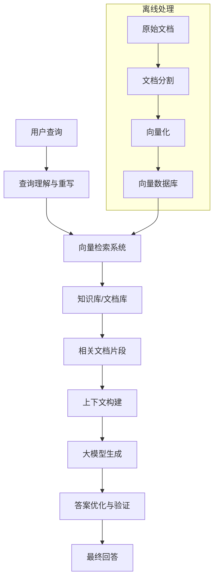

# RAG原理与架构深度解析（对比式学习）

## 🎯 核心问题：如何让大模型获得最新、准确、专业的知识？

### 1. RAG技术本质理解

#### **【已确认】RAG的核心概念**

**什么是RAG？**
RAG (Retrieval-Augmented Generation) = **检索增强生成**

**核心思想**：
```
传统大模型：问题 → 模型推理 → 回答
RAG模式：问题 → 检索相关信息 → 模型推理(问题+检索信息) → 回答
```

**解决的根本问题**：
1. **知识更新滞后**：模型训练数据有时间截止点
2. **领域知识不足**：通用模型缺乏专业领域深度
3. **幻觉问题**：模型可能生成看似合理但错误的信息
4. **可追溯性差**：无法验证信息来源

#### **【已确认】RAG vs 传统方法对比**

| 对比维度 | 传统大模型 | Fine-tuning | RAG技术 |
|----------|------------|-------------|---------|
| **知识更新** | 需要重新训练 | 需要重新训练 | 实时更新数据库 |
| **成本** | 极高 | 高 | 中等 |
| **响应速度** | 快 | 快 | 中等（检索+生成） |
| **准确性** | 存在幻觉 | 好，但有限 | 高（基于真实数据） |
| **可追溯性** | 无 | 无 | 可引用数据源 |
| **领域专业性** | 泛化 | 专业 | 专业 |
| **维护难度** | 无法维护 | 困难 | 相对容易 |

#### **【网络搜索，需验证】最新发展**
- 多模态RAG（图文检索）的兴起
- Graph RAG（知识图谱增强）的应用
- Self-RAG（自我修正检索）的研究进展

### 2. RAG架构深度剖析

#### **【已确认】经典RAG架构**

**核心组件解析**：



**详细流程分析**：

**1. 离线处理阶段**
- **文档收集**：收集领域相关的文档、资料
- **文档预处理**：清洗、格式化、去重
- **文档分割**：将长文档切分为可检索的chunk
- **向量化**：使用embedding模型将文本转换为向量
- **存储索引**：将向量存储到向量数据库并建立索引

**2. 在线检索阶段**
- **查询理解**：分析用户意图，优化查询语句
- **向量检索**：计算查询与文档的相似度，检索最相关内容
- **重排序**：使用更精确的模型对检索结果重新排序
- **上下文构建**：将检索到的信息组织成提示词

**3. 生成阶段**
- **提示词构建**：将查询+检索内容+指令组合
- **模型推理**：大模型基于完整上下文生成回答
- **答案后处理**：格式化、验证、引用标注

#### **【已确认】核心技术组件详解**

**A. 文档分割策略**
```
固定长度分割：按字符数或token数切分
  ├─ 优点：简单、一致
  └─ 缺点：可能破坏语义

语义分割：按段落、章节、主题切分
  ├─ 优点：保持语义完整性
  └─ 缺点：chunk大小不均匀

重叠分割：chunk之间有重叠部分
  ├─ 优点：减少信息丢失
  └─ 缺点：增加存储成本

递归分割：先大块后小块的层次分割
  ├─ 优点：平衡语义和长度
  └─ 缺点：复杂度较高
```

**B. 向量检索算法**
```
精确检索（暴力搜索）：
  - 计算查询向量与所有文档向量的余弦相似度
  - 优点：准确
  - 缺点：O(n)复杂度，大规模数据下很慢

近似检索（ANN）：
  ├─ LSH（局部敏感哈希）
  ├─ 基于树的方法（如Annoy）
  ├─ 基于图的方法（如HNSW）
  └─ 基于量化的方法（如IVF）
```

**C. Embedding模型选择**
```
通用模型：
  ├─ OpenAI text-embedding-ada-002
  ├─ Sentence-BERT
  └─ BGE（中文友好）

专业领域模型：
  ├─ 医疗：BioBERT、ClinicalBERT
  ├─ 法律：LegalBERT
  └─ 金融：FinBERT

多语言模型：
  ├─ Multilingual-E5
  ├─ mBERT
  └─ LaBSE
```

#### **【网络搜索，需验证】新兴架构**
- **分层RAG**：多级检索，从粗粒度到细粒度
- **混合检索**：结合稠密检索和稀疏检索
- **自适应RAG**：根据查询复杂度动态调整检索策略

### 3. RAG实现技术栈

#### **【已确认】主流技术组合**

**A. 向量数据库选择**
```
开源方案：
├─ Chroma：轻量级，适合原型开发
├─ Qdrant：高性能，支持过滤
├─ Weaviate：GraphQL接口，功能丰富
└─ Milvus：企业级，可扩展性强

云服务：
├─ Pinecone：全托管，易用性好
├─ AWS OpenSearch：与AWS生态集成
├─ Azure Cognitive Search：微软生态
└─ Google Vertex AI：谷歌云原生
```

**B. Embedding服务**
```
API服务：
├─ OpenAI Embeddings API
├─ Cohere Embed
└─ Azure OpenAI Embeddings

自部署：
├─ Sentence Transformers（开源）
├─ BGE模型（中文优化）
└─ E5系列（微软开源）
```

**C. 应用框架**
```
Python生态：
├─ LangChain：生态最丰富
├─ LlamaIndex：专注RAG场景
├─ Haystack：企业级框架
└─ txtai：轻量级选择

企业级：
├─ AWS Bedrock Knowledge Bases
├─ Azure AI Search + OpenAI
└─ Google Vertex AI Search
```

#### **【已确认】实现复杂度分析**

**简单RAG（适合原型验证）**：
```python
# 伪代码示例
def simple_rag(query, documents):
    # 1. 向量化文档（一次性）
    doc_embeddings = embed_model(documents)
    
    # 2. 向量化查询
    query_embedding = embed_model(query)
    
    # 3. 计算相似度检索
    similarities = cosine_similarity(query_embedding, doc_embeddings)
    top_docs = get_top_k(similarities, k=3)
    
    # 4. 构建prompt
    context = "\n".join(top_docs)
    prompt = f"基于以下信息回答问题：\n{context}\n\n问题：{query}"
    
    # 5. 生成答案
    answer = llm(prompt)
    return answer
```

**企业级RAG（生产可用）**：
- **数据管道**：自动化的文档处理和更新
- **多路检索**：稠密+稀疏检索结合
- **质量控制**：答案验证、幻觉检测
- **用户反馈**：持续学习和优化
- **监控指标**：检索准确率、生成质量、响应时间

### 4. RAG的优化策略

#### **【已确认】检索优化**

**A. 查询优化**
```
查询重写：
├─ 同义词扩展
├─ 查询纠错
├─ 多角度重写
└─ 历史查询学习

查询分解：
├─ 复杂查询拆分为子查询
├─ 时间敏感信息提取
└─ 多轮对话上下文理解
```

**B. 检索策略优化**
```
混合检索：
├─ 语义检索（Dense Retrieval）
├─ 关键词检索（BM25）
├─ 知识图谱检索
└─ 结果融合与重排序

多阶段检索：
├─ 粗召回：快速筛选候选文档
├─ 精排序：使用复杂模型重排
└─ 多样性保证：避免结果过于相似
```

**C. 上下文优化**
```
信息压缩：
├─ 关键信息提取
├─ 冗余信息去除
└─ 摘要生成

上下文组织：
├─ 按相关性排序
├─ 按时间排序
├─ 主题聚类组织
└─ 引用信息添加
```

#### **【已确认】生成优化**

**A. Prompt工程**
```
基础模板：
"基于以下信息回答问题，如果信息不足请说明：
信息来源：{sources}
问题：{query}
要求：准确、简洁，标注信息来源"

高级模板：
- 角色设定：你是某领域专家
- 思维链：请一步步分析
- 格式要求：按要点回答
- 不确定性处理：区分确定和推测内容
```

**B. 生成后处理**
```
答案验证：
├─ 事实核查：与检索内容对比
├─ 逻辑一致性检查
├─ 幻觉检测
└─ 置信度评估

格式优化：
├─ 结构化输出
├─ 引用标注
├─ 相关性评分
└─ 补充建议
```

#### **【网络搜索，需验证】前沿优化技术**
- **自适应检索**：根据查询类型动态调整检索策略
- **迭代优化**：基于生成结果反馈优化检索
- **多模态融合**：结合文本、图像、表格信息

### 5. RAG应用场景深度分析

#### **【已确认】典型应用场景**

**A. 企业知识库问答**
- **场景**：员工查询公司政策、流程、技术文档
- **优势**：实时更新、权威来源、可追溯
- **实现**：内部文档向量化 + 权限控制 + 多轮对话

**B. 客户服务智能化**
- **场景**：产品咨询、技术支持、售后服务
- **优势**：24/7服务、标准化回答、降低人工成本
- **实现**：产品手册 + FAQ + 工单历史数据

**C. 研究辅助工具**
- **场景**：学术研究、市场分析、竞品调研
- **优势**：信息全面、来源标注、多角度分析
- **实现**：论文数据库 + 报告库 + 新闻数据

**D. 法律文档分析**
- **场景**：合同审查、法规查询、案例研究
- **优势**：专业准确、引用法条、风险提示
- **实现**：法律法规库 + 案例库 + 专业词典

#### **【已确认】成功实施案例**

**案例1：某大型咨询公司知识管理**
- **背景**：10万+内部报告，员工查找困难
- **方案**：RAG + 权限管理 + 多语言支持
- **效果**：
  - 查询效率提升80%
  - 知识复用率提升60%
  - 新员工上手时间减少50%

**案例2：医疗诊断辅助系统**
- **背景**：医学文献更新快，医生难以全面掌握
- **方案**：最新医学文献 + 诊断指南 + 病例库
- **效果**：
  - 诊断准确率提升15%
  - 治疗方案查询时间从小时降到分钟
  - 医生满意度显著提升

#### **【网络搜索，需验证】新兴应用**
- **代码助手增强**：结合项目文档的智能编程助手
- **个性化教育**：基于学习材料的个性化答疑
- **投资研究**：整合财报、新闻、分析师报告的投资助手

### 6. RAG技术挑战与解决方案

#### **【已确认】主要技术挑战**

**A. 检索质量问题**
```
问题：检索到的信息不相关或不准确
原因：
├─ Embedding模型表达能力有限
├─ 文档分割不合理
├─ 查询理解不准确
└─ 向量相似度与语义相关性不完全一致

解决方案：
├─ 混合检索策略（稠密+稀疏）
├─ 查询扩展和重写
├─ 检索结果重排序
└─ 人工反馈优化
```

**B. 上下文长度限制**
```
问题：检索到的信息过多，超出模型上下文限制
原因：
├─ 大模型有token限制（如4K、8K、128K）
├─ 检索结果包含冗余信息
└─ 重要信息可能被截断

解决方案：
├─ 智能信息压缩和摘要
├─ 多轮检索和生成
├─ 长上下文模型（如Claude-100K）
└─ 分层次信息组织
```

**C. 实时性与一致性**
```
问题：知识库更新后，检索结果不一致
原因：
├─ 向量索引更新延迟
├─ 缓存机制影响
└─ 分布式系统同步问题

解决方案：
├─ 增量索引更新机制
├─ 版本控制和回滚
├─ 一致性检查工具
└─ 实时监控和告警
```

#### **【已确认】性能优化挑战**

**延迟优化**：
- **检索延迟**：向量搜索优化、索引结构优化
- **生成延迟**：模型选择、并行处理、缓存策略
- **总体延迟**：异步处理、预计算、智能缓存

**吞吐量优化**：
- **并发处理**：多线程检索、批量生成
- **资源复用**：连接池、模型复用
- **负载均衡**：分布式部署、动态扩容

#### **【网络搜索，需验证】前沿解决方案**
- **神经检索优化**：端到端训练的检索模型
- **知识图谱增强**：结构化知识与向量检索结合
- **自监督学习**：无标注数据的检索优化

### 7. RAG评估指标体系

#### **【已确认】评估维度**

**A. 检索质量指标**
```
召回率（Recall）：
- 定义：相关文档被检索到的比例
- 计算：检索到的相关文档数 / 所有相关文档数
- 重要性：确保不遗漏重要信息

精确率（Precision）：
- 定义：检索结果中相关文档的比例
- 计算：检索到的相关文档数 / 检索到的总文档数
- 重要性：减少噪音信息

F1分数：
- 定义：召回率和精确率的调和平均
- 计算：2 * (Precision * Recall) / (Precision + Recall)
- 重要性：综合评估检索质量

MRR（Mean Reciprocal Rank）：
- 定义：相关结果排名的倒数平均值
- 重要性：评估排序质量
```

**B. 生成质量指标**
```
事实准确性：
├─ 与检索内容的一致性
├─ 外部知识库验证
└─ 人工评估标准

答案完整性：
├─ 是否回答了用户问题
├─ 信息覆盖程度
└─ 逻辑连贯性

引用准确性：
├─ 引用来源的正确性
├─ 引用内容的相关性
└─ 引用格式的规范性
```

**C. 用户体验指标**
```
响应时间：
├─ 平均响应延迟
├─ 95%分位数延迟
└─ 超时率

用户满意度：
├─ 答案有用性评分
├─ 用户反馈统计
└─ 使用频率变化

系统可用性：
├─ 系统稳定性
├─ 错误率统计
└─ 服务可达性
```

#### **【已确认】评估方法**

**自动化评估**：
```python
# 基于相似度的评估
def evaluate_retrieval(query, retrieved_docs, ground_truth):
    # 计算检索文档与标准答案的相似度
    similarities = compute_similarity(retrieved_docs, ground_truth)
    
    # 计算各种指标
    precision = calculate_precision(similarities, threshold=0.7)
    recall = calculate_recall(similarities, threshold=0.7)
    f1 = 2 * precision * recall / (precision + recall)
    
    return {"precision": precision, "recall": recall, "f1": f1}
```

**人工评估**：
- **专家评估**：领域专家对答案质量打分
- **用户测试**：真实用户使用反馈
- **A/B测试**：不同方案效果对比

### 8. RAG技术发展趋势

#### **【已确认】明确发展方向**

**1. 技术演进趋势**
```
检索技术：
稀疏检索 → 稠密检索 → 混合检索 → 神经检索

生成技术：
模板生成 → 上下文生成 → 推理生成 → 交互生成

架构演进：
简单RAG → 模块化RAG → 端到端RAG → 自适应RAG
```

**2. 应用场景扩展**
- **从文本到多模态**：图像、表格、音频、视频
- **从问答到任务执行**：规划、调用工具、执行操作
- **从单轮到多轮**：复杂对话、上下文记忆

**3. 性能提升方向**
- **准确性**：更精确的检索、更可靠的生成
- **效率**：更快的响应、更低的成本
- **可控性**：更好的解释性、更强的可控性

#### **【网络搜索，需验证】前沿研究方向**
- **Graph RAG**：基于知识图谱的检索增强
- **Tool-using RAG**：集成外部工具的RAG系统
- **Self-improving RAG**：自动优化的RAG系统
- **Federated RAG**：分布式隐私保护的RAG

### 9. 实践建议与最佳实践

#### **【已确认】实施路径**

**阶段1：概念验证 (POC)**
```
目标：验证RAG在特定场景下的可行性
步骤：
1. 选择小规模数据集（100-1000个文档）
2. 使用现成工具（如LangChain + OpenAI）
3. 实现基础RAG流程
4. 评估初步效果

时间：2-4周
人员：1-2个技术人员
成本：低（主要是API费用）
```

**阶段2：原型开发**
```
目标：构建可演示的RAG系统
步骤：
1. 扩大数据规模（1000-10000个文档）
2. 优化检索和生成策略
3. 添加用户界面
4. 建立评估指标

时间：1-2个月
人员：2-4个技术人员
成本：中等
```

**阶段3：生产部署**
```
目标：构建生产级RAG系统
步骤：
1. 完整数据处理管道
2. 性能优化和扩展
3. 监控和运维体系
4. 安全和合规保障

时间：3-6个月
人员：完整开发团队
成本：高
```

#### **【已确认】技术选型建议**

**初学者推荐技术栈**：
```
向量数据库：Chroma（简单易用）
Embedding：OpenAI text-embedding-ada-002
大模型：OpenAI GPT-3.5/4
框架：LangChain
开发语言：Python
```

**企业级推荐技术栈**：
```
向量数据库：Qdrant/Milvus（高性能）
Embedding：自部署BGE模型（中文场景）
大模型：Claude-3/GPT-4（根据需求选择）
框架：自研（更好的控制性）
开发语言：Python + FastAPI
```

#### **【已确认】常见误区与避坑指南**

**误区1：认为RAG是万能的**
- **现实**：RAG适合知识密集型任务，不适合需要复杂推理的任务
- **建议**：明确应用边界，结合其他技术

**误区2：过度复杂化**
- **现实**：很多场景简单RAG就足够
- **建议**：从简单开始，逐步优化

**误区3：忽视数据质量**
- **现实**：垃圾数据进，垃圾结果出
- **建议**：重视数据清洗和质量控制

**误区4：只关注技术，忽视产品**
- **现实**：技术再好，用户体验差也没用
- **建议**：关注用户需求和使用体验

## 🎯 知识检查点

### 基础理解
1. RAG解决了大模型的哪些核心问题？
2. RAG的基本工作流程是什么？
3. 向量检索的原理是什么？

### 深入分析
1. 为什么需要文档分割，有哪些分割策略？
2. 如何评估RAG系统的质量？
3. RAG与Fine-tuning相比有什么优劣势？

### 实践应用
1. 如何为特定业务场景设计RAG系统？
2. 如何优化RAG的检索精度和生成质量？
3. 如何评估RAG项目的ROI？

## 📝 关键要点总结

1. **【已确认】核心价值**：RAG通过检索外部知识解决了大模型知识更新和领域专业性问题
2. **【已确认】技术架构**：离线文档处理 + 在线检索生成的两阶段架构
3. **【已确认】实施策略**：从POC到生产的渐进式实施路径
4. **【网络搜索，需验证】发展趋势**：多模态、图谱增强、自适应优化是未来方向

## 📊 实践工具

### RAG项目评估表
| 评估维度 | 权重 | 评分(1-5) | 说明 |
|---------|------|-----------|------|
| 数据质量 | 30% | | 文档完整性、准确性、时效性 |
| 技术可行性 | 25% | | 检索精度、生成质量、响应速度 |
| 业务价值 | 25% | | 解决痛点、用户接受度、ROI |
| 实施难度 | 20% | | 技术复杂度、资源需求、风险 |

### RAG技术选型对比
| 组件 | 开源方案 | 云服务方案 | 建议场景 |
|------|----------|------------|----------|
| 向量数据库 | Chroma, Qdrant | Pinecone, AWS OpenSearch | 根据规模和预算选择 |
| Embedding | Sentence-BERT, BGE | OpenAI, Cohere | 中文场景推荐BGE |
| 大模型 | Llama, ChatGLM | GPT-4, Claude | 商业场景推荐API |

---

**当前学习路线**：大模型应用全链路学习路线（2025版·知识为主·实战为辅）
**当前进度**：阶段二 - 模块5（RAG技术）已完成 ✅

RAG技术是当前最实用的大模型应用技术，掌握了RAG原理和架构，您就具备了构建企业级AI应用的核心能力！

准备继续学习下一个模块吗？接下来我们将学习**多模态大模型**的概念和应用。 