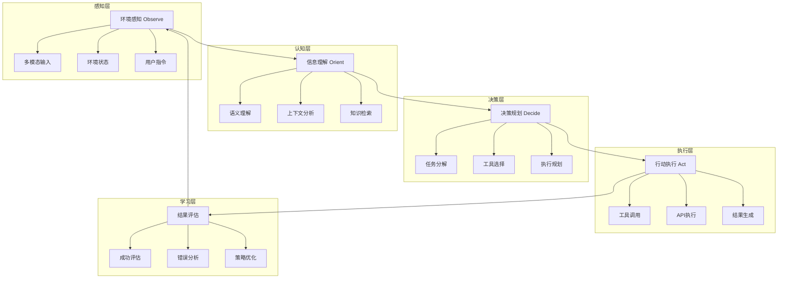

# Agent系统架构与工作原理深度解析（对比式学习）

## 🎯 核心问题：如何让AI从被动回答转向主动思考和行动？

### 1. Agent技术本质理解

#### **【已确认】Agent的核心概念**

**什么是AI Agent？**
AI Agent = **具有自主感知、推理、规划和执行能力的智能代理系统**

**核心思想对比**：
```
传统AI模型：
用户输入 → 模型处理 → 直接输出

Agent系统：
环境感知 → 目标规划 → 工具调用 → 行动执行 → 结果评估 → 学习优化
```

**解决的根本问题**：
1. **被动性**：传统AI只能响应，无法主动规划
2. **单一性**：无法处理复杂的多步骤任务
3. **局限性**：无法与外部环境和工具交互
4. **不持续性**：无法从历史经验中学习改进

#### **【已确认】Agent vs 传统AI对比**

| 对比维度 | 传统AI模型 | Agent系统 |
|----------|------------|-----------|
| **工作模式** | 被动响应 | 主动规划和执行 |
| **任务处理** | 单轮对话 | 多步骤任务分解 |
| **工具使用** | 无法调用外部工具 | 可调用各种API和工具 |
| **记忆能力** | 无长期记忆 | 具有持久化记忆 |
| **学习能力** | 静态模型 | 动态学习和改进 |
| **目标导向** | 回答问题 | 完成复杂目标 |
| **环境交互** | 文本输入输出 | 多维度环境感知和操作 |

#### **【网络搜索，需验证】最新发展**
- Multi-Agent协作系统的快速发展
- Agent与RAG、多模态的深度融合
- 自我反思和自我改进的Agent架构
- 具身智能Agent在机器人领域的应用

### 2. Agent核心架构深度剖析

#### **【已确认】经典Agent架构**

**OODA循环架构**（Observe-Orient-Decide-Act）：


**核心组件详解**：

**A. 感知模块（Perception）**
```
输入处理：
├─ 文本理解：自然语言指令解析
├─ 多模态感知：图像、音频、视频理解
├─ 环境状态：系统状态、API返回值
└─ 历史记忆：过往交互和执行历史

信息融合：
├─ 上下文整合：当前任务与历史的关联
├─ 优先级排序：多个输入的重要性判断
├─ 噪声过滤：无关信息的筛除
└─ 结构化表示：信息的标准化处理
```

**B. 推理模块（Reasoning）**
```
任务理解：
├─ 意图识别：用户真实需求分析
├─ 目标提取：明确的可执行目标
├─ 约束条件：限制和要求识别
└─ 成功标准：完成判断依据

知识运用：
├─ 常识推理：基于常识的逻辑推断
├─ 专业知识：领域特定的知识应用
├─ 经验学习：历史成功案例的应用
└─ 类比推理：相似情况的经验迁移
```

**C. 规划模块（Planning）**
```
任务分解：
├─ 层次分解：大任务拆分为子任务
├─ 依赖分析：任务间的依赖关系
├─ 并行识别：可并行执行的任务
└─ 关键路径：最优执行路径规划

资源调度：
├─ 工具选择：最适合的工具和API
├─ 时间规划：执行顺序和时间安排
├─ 风险评估：潜在问题和备选方案
└─ 成本考虑：资源消耗和效率平衡
```

**D. 执行模块（Execution）**
```
工具调用：
├─ API集成：各种外部服务调用
├─ 数据库操作：信息存储和检索
├─ 文件处理：文档读写和处理
└─ 网络请求：Web服务和爬虫

执行监控：
├─ 进度跟踪：任务执行状态监控
├─ 错误处理：异常情况的应对
├─ 超时管理：长时间执行的控制
└─ 结果验证：输出质量的检查
```

**E. 记忆模块（Memory）**
```
短期记忆：
├─ 会话上下文：当前对话的完整历史
├─ 任务状态：当前任务的执行进度
├─ 临时变量：执行过程中的中间结果
└─ 工作缓存：频繁访问的信息

长期记忆：
├─ 知识库：经验和教训的积累
├─ 技能库：成功模式和最佳实践
├─ 关系图：用户偏好和行为模式
└─ 配置信息：个性化设置和参数
```

#### **【已确认】主流架构模式**

**1. ReAct架构（Reason + Act）**
```
特点：推理和行动交替进行
流程：思考 → 行动 → 观察 → 思考 → 行动...
优点：透明的推理过程，可控的执行步骤
缺点：可能陷入推理循环，效率相对较低
适用：需要解释性的复杂问题解决
```

**2. Plan-and-Execute架构**
```
特点：先制定完整计划，再逐步执行
流程：理解目标 → 制定计划 → 执行步骤 → 调整计划
优点：目标明确，执行高效
缺点：应对突发情况能力弱
适用：目标明确的结构化任务
```

**3. Reflexion架构**
```
特点：具有自我反思和改进能力
流程：执行 → 反思 → 学习 → 改进 → 重新执行
优点：持续改进，错误自纠正
缺点：复杂度高，资源消耗大
适用：需要持续优化的长期任务
```

#### **【网络搜索，需验证】新兴架构**
- **Multi-Agent协作架构**：多个专业Agent的协同工作
- **分层Agent架构**：管理Agent + 执行Agent的层次结构
- **自适应Agent架构**：根据任务类型动态调整架构
- **联邦Agent架构**：分布式Agent网络协作

### 3. 主流Agent框架深度对比

#### **【已确认】核心开发框架**

**A. LangChain Agents**
```
技术特点：
├─ 丰富的工具生态：内置大量工具和集成
├─ 灵活的架构设计：支持多种Agent类型
├─ 强大的链式调用：复杂工作流构建
└─ 活跃的社区支持：文档丰富，更新频繁

支持的Agent类型：
├─ Zero-shot ReAct：基础的推理-行动Agent
├─ Conversational ReAct：对话式Agent
├─ Plan-and-execute：规划执行型Agent
└─ Custom Agent：自定义Agent架构

典型应用：
├─ 问答系统：基于工具的智能问答
├─ 数据分析：自动化数据处理和分析
├─ 内容生成：多步骤内容创作
└─ 任务自动化：复杂业务流程自动化

优势与局限：
├─ 优势：生态完善、易于上手、社区活跃
├─ 局限：性能开销较大、调试复杂
└─ 适用：快速原型开发、中小型项目
```

**B. AutoGen (Microsoft)**
```
技术特点：
├─ 多Agent对话：多个Agent协作解决问题
├─ 角色专业化：每个Agent有特定职责
├─ 灵活编排：支持复杂的交互模式
└─ 代码执行：内置代码运行环境

核心组件：
├─ UserProxyAgent：用户代理，人机交互
├─ AssistantAgent：助手代理，任务执行
├─ GroupChat：群聊模式，多Agent讨论
└─ ConversableAgent：可对话代理基类

典型应用：
├─ 代码开发：多Agent协作编程
├─ 数据科学：分析师+工程师协作
├─ 内容创作：作者+编辑+审核协作
└─ 教育培训：老师+学生+助教互动

优势与局限：
├─ 优势：多Agent协作、角色明确、微软支持
├─ 局限：相对复杂、学习成本高
└─ 适用：团队协作场景、复杂项目
```

**C. CrewAI**
```
技术特点：
├─ 团队协作：模拟真实团队工作模式
├─ 角色定义：明确的职责和能力边界
├─ 任务流程：结构化的任务执行流程
└─ 质量控制：内置审核和质量保证

核心概念：
├─ Crew：Agent团队，类似项目组
├─ Agent：团队成员，具有特定技能
├─ Task：具体任务，有明确目标
└─ Process：执行流程，顺序或并行

典型应用：
├─ 产品开发：PM+设计师+开发者协作
├─ 市场研究：研究员+分析师+报告员
├─ 内容营销：策划+创作+审核+发布
└─ 客户服务：接待+技术+质检+回访

优势与局限：
├─ 优势：团队模拟真实、流程清晰
├─ 局限：框架较新、生态待完善
└─ 适用：企业级应用、团队协作
```

**D. MetaGPT**
```
技术特点：
├─ 软件开发：专注软件工程全流程
├─ 角色扮演：产品经理、架构师、程序员
├─ 文档驱动：重视文档和设计
└─ 代码生成：自动生成完整项目

核心流程：
├─ 需求分析：产品经理分析需求
├─ 系统设计：架构师设计系统
├─ 代码实现：程序员编写代码
└─ 测试验证：测试工程师验证

典型应用：
├─ 软件开发：自动化软件项目开发
├─ 原型制作：快速原型和Demo开发
├─ 代码审查：自动化代码质量检查
└─ 文档生成：自动生成技术文档

优势与局限：
├─ 优势：软件工程专业化、流程标准
├─ 局限：专注软件开发、适用面窄
└─ 适用：软件开发项目、代码生成
```

#### **【已确认】框架对比矩阵**

| 对比维度 | LangChain | AutoGen | CrewAI | MetaGPT |
|----------|-----------|---------|--------|---------|
| **学习成本** | 低 | 中 | 中 | 高 |
| **生态完善度** | ⭐⭐⭐⭐⭐ | ⭐⭐⭐⭐ | ⭐⭐⭐ | ⭐⭐⭐ |
| **多Agent支持** | ⭐⭐⭐ | ⭐⭐⭐⭐⭐ | ⭐⭐⭐⭐⭐ | ⭐⭐⭐⭐ |
| **工具集成** | ⭐⭐⭐⭐⭐ | ⭐⭐⭐ | ⭐⭐⭐ | ⭐⭐ |
| **执行效率** | ⭐⭐⭐ | ⭐⭐⭐⭐ | ⭐⭐⭐⭐ | ⭐⭐⭐ |
| **可定制性** | ⭐⭐⭐⭐ | ⭐⭐⭐⭐ | ⭐⭐⭐ | ⭐⭐ |
| **企业应用** | ⭐⭐⭐ | ⭐⭐⭐⭐ | ⭐⭐⭐⭐⭐ | ⭐⭐⭐ |

#### **【网络搜索，需验证】新兴框架**
- **LlamaIndex Agents**：专注RAG增强的Agent系统
- **Semantic Kernel**：微软的企业级Agent框架
- **Haystack Agents**：面向搜索和NLP的Agent
- **国产框架**：如智谱的AgentScope、百度的ERNIE Agent等

### 4. Agent应用场景深度分析

#### **【已确认】核心应用领域**

**A. 智能客户服务**
```
单Agent模式：
├─ 基础客服：FAQ回答、问题路由
├─ 技术支持：故障诊断、解决方案推荐
├─ 销售助手：产品推荐、订单处理
└─ 情感分析：客户满意度监测

多Agent协作：
├─ 一线客服：初步问题处理和分类
├─ 技术专家：复杂技术问题解决
├─ 业务专家：业务流程和政策解答
└─ 质检专员：服务质量监控和改进
```

**B. 智能内容创作**
```
创作团队模拟：
├─ 策划Agent：确定主题、目标受众、内容框架
├─ 研究Agent：收集资料、事实查证、数据分析
├─ 写作Agent：内容创作、风格调整、结构优化
├─ 编辑Agent：文字校对、逻辑检查、质量控制
└─ SEO专家：关键词优化、搜索引擎友好

工作流程：
策划制定大纲 → 研究收集素材 → 写作生成内容 → 编辑优化文案 → SEO最终优化
```

**C. 数据分析与洞察**
```
分析师团队：
├─ 数据工程师：数据收集、清洗、预处理
├─ 统计分析师：描述性统计、趋势分析
├─ 机器学习工程师：模型构建、预测分析
├─ 业务分析师：业务解读、洞察提炼
└─ 报告专家：可视化、报告生成

自动化流程：
数据收集 → 数据清洗 → 探索分析 → 模型构建 → 结果解读 → 报告生成
```

**D. 软件开发助手**
```
开发团队：
├─ 产品经理：需求分析、用户故事、优先级排序
├─ 架构师：系统设计、技术选型、架构规划
├─ 开发工程师：代码编写、功能实现、单元测试
├─ 测试工程师：测试用例设计、自动化测试
└─ DevOps工程师：部署流程、监控告警

开发流程：
需求分析 → 架构设计 → 代码实现 → 测试验证 → 部署上线 → 运维监控
```

#### **【已确认】成功实施案例**

**案例1：某电商平台的智能客服系统**
- **背景**：日均客服咨询10万+，人工成本高，响应速度慢
- **方案**：
  - 一线Agent：基础问题自动回答，复杂问题分类路由
  - 专家Agent：订单、退款、物流等专业问题处理
  - 监督Agent：质量监控、异常情况升级
- **效果**：
  - 自动解决率从30%提升到80%
  - 平均响应时间从5分钟降到30秒
  - 客户满意度提升25%
  - 人工客服成本降低60%

**案例2：某咨询公司的报告生成系统**
- **背景**：市场研究报告制作周期长，质量不一致
- **方案**：
  - 研究Agent：自动收集行业数据、新闻、报告
  - 分析Agent：数据分析、趋势识别、竞争分析
  - 写作Agent：报告结构设计、内容撰写
  - 审核Agent：事实核查、逻辑检验、格式规范
- **效果**：
  - 报告生成时间从2周缩短到2天
  - 数据覆盖面提升300%
  - 报告质量一致性显著提升
  - 分析师工作效率提升500%

**案例3：某软件公司的代码审查系统**
- **背景**：代码审查依赖人工，效率低，标准不统一
- **方案**：
  - 代码分析Agent：静态代码分析、安全漏洞检测
  - 最佳实践Agent：代码规范检查、性能优化建议
  - 测试Agent：测试覆盖率检查、测试用例建议
  - 文档Agent：代码注释检查、文档生成
- **效果**：
  - 代码审查速度提升10倍
  - 代码质量问题发现率提升40%
  - 开发团队效率提升30%
  - 代码维护成本降低50%

#### **【网络搜索，需验证】新兴应用**
- **智能投研助手**：多Agent协作进行投资研究和分析
- **法律文档处理**：合同审查、法律风险分析Agent团队
- **医疗诊断辅助**：多专科Agent协作诊断复杂病例
- **智能制造**：生产流程优化、质量控制Agent系统

### 5. Agent技术挑战与解决方案

#### **【已确认】核心技术挑战**

**A. 协调与通信挑战**
```
问题：多Agent间的协调复杂，通信开销大
具体表现：
├─ 信息冗余：重复的信息传递和处理
├─ 决策冲突：不同Agent的决策存在矛盾
├─ 死锁问题：Agent间相互等待造成停滞
└─ 通信成本：频繁交互导致性能下降

解决方案：
├─ 中央协调器：统一的任务分配和状态管理
├─ 异步通信：减少同步等待，提高并发性
├─ 冲突解决机制：优先级规则、投票机制
└─ 通信优化：消息压缩、批处理、缓存
```

**B. 任务分解与规划**
```
问题：复杂任务的自动分解和合理规划困难
具体表现：
├─ 分解粒度：过粗导致执行困难，过细导致效率低
├─ 依赖关系：复杂的任务依赖难以自动识别
├─ 动态调整：执行过程中的计划调整困难
└─ 资源约束：有限资源下的最优规划

解决方案：
├─ 层次规划：多层次的任务分解策略
├─ 依赖图分析：自动识别和管理任务依赖
├─ 动态重规划：基于执行反馈的计划调整
└─ 资源感知规划：考虑资源约束的智能规划
```

**C. 错误处理与恢复**
```
问题：Agent执行过程中的错误处理和系统恢复
具体表现：
├─ 工具调用失败：API超时、服务不可用
├─ 推理错误：逻辑错误、知识不足
├─ 协作失败：Agent间协作出现问题
└─ 系统异常：硬件故障、网络中断

解决方案：
├─ 重试机制：智能重试策略和熔断保护
├─ 备选方案：多种工具和方法的备选
├─ 回滚机制：执行失败时的状态回滚
└─ 监控告警：实时监控和异常预警
```

#### **【已确认】性能与效率挑战**

**成本控制**：
- **Token消耗**：大模型API调用成本高
- **计算资源**：多Agent并发执行的资源需求
- **时间成本**：复杂任务的执行时间长
- **维护成本**：系统维护和优化的人力成本

**解决策略**：
- **智能缓存**：结果缓存、中间状态保存
- **批处理优化**：批量处理相似任务
- **负载均衡**：动态资源分配和调度
- **成本监控**：实时成本跟踪和预算控制

#### **【网络搜索，需验证】前沿解决方案**
- **联邦Agent学习**：分布式Agent训练和知识共享
- **Agent能力图谱**：动态能力发现和匹配
- **自适应协作机制**：根据任务特点自动调整协作模式
- **Agent安全框架**：恶意Agent检测和防护

### 6. Agent评估与优化体系

#### **【已确认】评估维度框架**

**A. 任务完成质量**
```
正确性评估：
├─ 任务完成率：成功完成任务的比例
├─ 输出质量：结果的准确性和完整性
├─ 目标达成度：实际结果与预期目标的匹配
└─ 用户满意度：最终用户的满意程度

效率评估：
├─ 执行时间：完成任务所需的总时间
├─ 资源消耗：计算、存储、网络资源使用
├─ 成本效益：单位成本的价值产出
└─ 并发能力：同时处理多任务的能力
```

**B. 协作效果评估**
```
协作质量：
├─ 沟通效率：Agent间信息传递的有效性
├─ 决策一致性：多Agent决策的协调性
├─ 冲突解决：处理决策冲突的能力
└─ 知识共享：Agent间知识和经验的共享

系统稳定性：
├─ 容错能力：单点故障的恢复能力
├─ 扩展性：系统规模扩展的适应性
├─ 可维护性：系统更新和维护的便利性
└─ 监控可视化：系统状态的可观测性
```

**C. 学习与改进能力**
```
适应性：
├─ 环境变化：对环境变化的适应能力
├─ 任务变化：处理新类型任务的能力
├─ 用户偏好：学习和适应用户习惯
└─ 知识更新：吸收新知识和技能

优化效果：
├─ 性能提升：随时间推移的性能改善
├─ 错误减少：重复错误的避免能力
├─ 效率提升：执行效率的持续优化
└─ 经验积累：成功经验的固化和复用
```

#### **【已确认】评估方法与工具**

**自动化评估**：
```python
# Agent任务完成率评估示例
def evaluate_agent_performance(agent, test_cases):
    results = {
        'success_rate': 0,
        'avg_execution_time': 0,
        'cost_per_task': 0,
        'quality_score': 0
    }
    
    total_success = 0
    total_time = 0
    total_cost = 0
    quality_scores = []
    
    for task in test_cases:
        start_time = time.time()
        result = agent.execute_task(task)
        end_time = time.time()
        
        # 评估任务完成情况
        if result.is_successful:
            total_success += 1
            quality_scores.append(evaluate_output_quality(result, task.expected))
        
        total_time += (end_time - start_time)
        total_cost += result.cost
    
    results['success_rate'] = total_success / len(test_cases)
    results['avg_execution_time'] = total_time / len(test_cases)
    results['cost_per_task'] = total_cost / len(test_cases)
    results['quality_score'] = sum(quality_scores) / len(quality_scores) if quality_scores else 0
    
    return results
```

**人工评估**：
- **专家评估**：领域专家对Agent输出质量评分
- **用户测试**：真实用户的使用体验评估
- **对比测试**：与人工基准的效果对比
- **案例研究**：典型使用场景的深入分析

### 7. Agent技术发展趋势

#### **【已确认】明确发展方向**

**1. 技术演进趋势**
```
架构发展：
单Agent → 多Agent → Agent网络 → 自组织Agent生态

能力提升：
工具调用 → 环境感知 → 自主学习 → 创新创造

应用深化：
任务自动化 → 决策辅助 → 创意协作 → 科学发现
```

**2. 应用场景拓展**
- **从数字到物理**：具身智能、机器人Agent
- **从个体到组织**：企业级Agent、组织智能
- **从辅助到主导**：从工具角色向决策者角色转变
- **从专用到通用**：AGI级别的通用Agent系统

**3. 技术融合趋势**
- **与RAG结合**：知识增强的Agent系统
- **与多模态结合**：全感官的Agent交互
- **与IoT结合**：物联网设备的智能代理
- **与区块链结合**：去中心化的Agent协作

#### **【已确认】产业发展趋势**

**商业模式创新**：
- **Agent即服务（AaaS）**：云端Agent能力租用
- **Agent应用商店**：专业Agent的交易平台
- **定制Agent开发**：企业专属Agent定制服务
- **Agent协作平台**：多方Agent协作的平台服务

**标准化发展**：
- **Agent通信协议**：统一的Agent间通信标准
- **能力描述标准**：Agent能力的标准化描述
- **安全与伦理规范**：Agent行为的安全约束
- **评估测试标准**：Agent性能的统一评估

#### **【网络搜索，需验证】前沿研究**
- **自我进化Agent**：能够自我改进和升级的Agent
- **情感智能Agent**：具有情感理解和表达的Agent
- **创意Agent**：具有创新和创造能力的Agent
- **社会化Agent**：理解社会规范和文化的Agent

### 8. Agent实践指南与最佳实践

#### **【已确认】技术选型策略**

**A. 场景分析框架**
```
任务复杂度评估：
├─ 简单任务：单步骤，明确输入输出 → 单Agent
├─ 中等任务：多步骤，有条件分支 → ReAct Agent
├─ 复杂任务：多目标，需要协作 → 多Agent系统
└─ 超复杂任务：开放式，需要创新 → 自适应Agent网络

实时性要求：
├─ 实时响应：选择轻量级Agent架构
├─ 准实时：可接受适度的规划时间
├─ 批处理：可使用复杂的优化策略
└─ 离线处理：可进行深度分析和学习
```

**B. 框架选择指导**
```
项目规模考虑：
├─ 个人项目/原型：LangChain Agents（简单易用）
├─ 中小企业：CrewAI（团队协作模式）
├─ 大型企业：AutoGen（微软生态支持）
└─ 软件开发：MetaGPT（专业代码生成）

技术能力要求：
├─ 初学者：选择文档完善、示例丰富的框架
├─ 有经验：选择灵活性高、可定制性强的框架
├─ 专家级：可考虑自研或深度定制
└─ 团队开发：选择支持协作、易于维护的框架
```

#### **【已确认】实施最佳实践**

**设计原则**：
```
1. 单一职责原则：每个Agent专注特定职能
2. 松耦合设计：Agent间减少直接依赖
3. 可观测性：全程可监控、可调试
4. 容错设计：优雅处理各种异常情况
5. 渐进式改进：从简单开始，逐步优化
```

**开发流程**：
```
阶段1：需求分析 (1周)
├─ 明确目标和成功标准
├─ 识别关键任务和流程
├─ 评估技术可行性
└─ 制定开发计划

阶段2：架构设计 (1-2周)
├─ Agent角色和职责定义
├─ 交互流程和协作模式
├─ 技术架构和工具选择
└─ 数据和接口设计

阶段3：原型开发 (2-4周)
├─ 核心Agent功能实现
├─ 基础协作流程验证
├─ 关键场景测试
└─ 性能和稳定性初评

阶段4：完善优化 (2-6周)
├─ 全功能开发和集成
├─ 全面测试和优化
├─ 文档和维护工具
└─ 上线部署和监控
```

#### **【已确认】常见问题与解决方案**

**问题1：Agent执行效率低**
- **现象**：任务完成时间长，资源消耗大
- **原因**：规划不合理、工具选择不当、重复计算
- **解决**：优化规划算法、工具效率分析、结果缓存

**问题2：多Agent协作混乱**
- **现象**：Agent间冲突、重复工作、死锁
- **原因**：角色定义不清、通信机制不当、缺乏协调
- **解决**：明确职责边界、设计协调机制、监控协作状态

**问题3：系统稳定性差**
- **现象**：经常出错、崩溃、结果不一致
- **原因**：错误处理不足、测试不充分、边界情况
- **解决**：完善异常处理、增加测试覆盖、边界情况处理

## 🎯 知识检查点

### 基础理解
1. Agent与传统AI模型的核心区别是什么？
2. Agent系统的核心架构组件有哪些？
3. 主流Agent框架各有什么特点？

### 深入分析
1. 为什么多Agent协作比单Agent更有优势？
2. 如何设计有效的Agent协作机制？
3. Agent系统的主要技术挑战有哪些？

### 实践应用
1. 如何为特定业务场景设计Agent系统？
2. 如何评估Agent系统的性能和效果？
3. 如何确保Agent系统的稳定性和可维护性？

## 📝 关键要点总结

1. **【已确认】核心价值**：Agent实现了从被动响应到主动规划执行的转变
2. **【已确认】技术架构**：感知-推理-规划-执行-学习的闭环架构
3. **【已确认】主流框架**：LangChain、AutoGen、CrewAI、MetaGPT各有特色
4. **【网络搜索，需验证】发展趋势**：多Agent协作、自我进化、具身智能是未来方向

## 📊 实践工具

### Agent项目评估表
| 评估维度 | 权重 | 评分(1-5) | 说明 |
|---------|------|-----------|------|
| 任务适配性 | 30% | | Agent能力与任务需求的匹配度 |
| 技术可行性 | 25% | | 技术复杂度和实现难度 |
| 协作效率 | 25% | | 多Agent协作的效率和质量 |
| 维护成本 | 20% | | 开发、部署、运维的综合成本 |

### Agent技术选型对比
| 应用场景 | 推荐框架 | 复杂度 | 学习成本 | 适用规模 |
|----------|----------|--------|----------|----------|
| 简单自动化 | LangChain | 低 | 低 | 小型 |
| 团队协作 | CrewAI | 中 | 中 | 中型 |
| 企业级应用 | AutoGen | 中 | 中 | 大型 |
| 软件开发 | MetaGPT | 高 | 高 | 专业 |
| 自定义需求 | 自研 | 极高 | 极高 | 所有 |

---

**恭喜！您已完成阶段二的全部核心技术学习！** 🎉

**当前学习路线**：大模型应用全链路学习路线（2025版·知识为主·实战为辅）
**当前进度**：阶段二完成 ✅ (3/3模块全部完成)

**已掌握的核心技术栈**：
- ✅ **RAG技术**：知识增强的企业级AI应用
- ✅ **多模态大模型**：跨模态理解和交互能力  
- ✅ **Agent系统**：主动规划和执行的智能代理

您现在已经具备了构建现代AI应用的完整技术基础！准备进入下一阶段的学习吗？ 